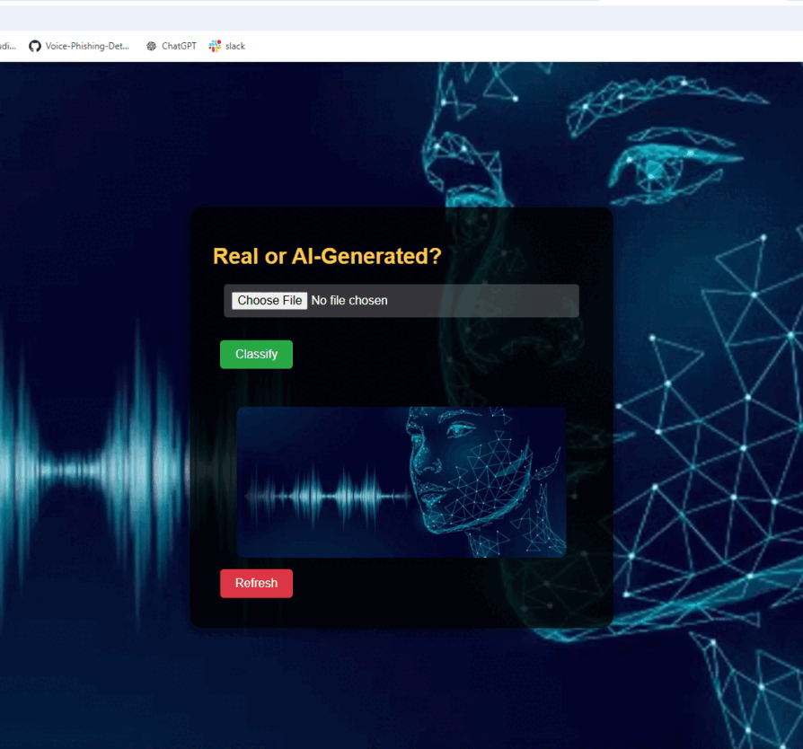

# Vox-Verify: AI vs. Human Voice Classification Using Wav2Vec2
<p align="center">
  
  
  </p>
  
## 🌟 Overview 🌟

> **About the name:** *Vox* is the Latin word for **"voice"** — a fitting root for a project whose whole purpose is to scrutinize a voice and verify whether it is genuinely human or AI-generated.

This project provides an end-to-end solution for classifying audio into **human** or **AI-generated** categories using the **Wav2Vec2** model. It supports multi-class classification and distinguishes between real voices and synthetic audio generated by models like **DiffWave**, **WaveNet**, and more. The pipeline includes:

- **Dataset Preparation**: Combine human and AI-generated audio into a structured, multi-class dataset.
- **Preprocessing**: Resample audio, normalize lengths, and Convert to HuggingFace Dataset format.
- **Fine-Tuning**: Adapt Wav2Vec2 for custom classification tasks.
- **Inference**: Classify unseen audio with confidence scores.
- **API Deployment**: Real-time predictions via FastAPI.

---

## 🚀 Key Features

- **Multi-Class Audio Classification**: Supports detection of human voices and six AI-generated classes (DiffWave, WaveNet, etc.).
- **Optimized for Performance**: Includes techniques like attention masks, quantization, and ONNX conversion for efficiency.
- **Deployment-Ready**: Real-time audio classification using FastAPI.

## DEMO


If you find this project helpful or inspiring, please consider giving it a star 🌟 on GitHub! Your support motivates me to keep improving and sharing my work with the community. 

## Dataset

### **Source**
The dataset is derived from the **LibriSeVoc** corpus, which includes real human audio samples and synthetic speech generated by:
- **DiffWave**
- **WaveNet**
- **MelGAN**
- **Parallel WaveGAN**
- **WaveGrad**
- **WaveRNN**

### **Structure**
- Real human voices are stored in the `gt` folder.
- AI-generated voices are organized into separate folders (`diffwave`, `wavenet`, etc.).
- Dataset includes **13,201 samples** per class, ensuring balance.

## 📂 File Structure
* ├── prepare_data.py # Combine raw audio into a CSV dataset 
* ├── process_audio.py # Resample, pad, and preprocess audio
* ├── prepare_hf_dataset.py # Convert to HuggingFace Dataset format
* ├── fine-tune.py # Fine-tune Wav2Vec2 on the dataset 
* ├── inference.py # Perform inference on unseen audio 
* ├── app.py # FastAPI app for real-time classification 
* ├── README.md # Documentation

📚 Acknowledgements
* [LibriSeVoc](https://drive.google.com/file/d/1NXF9w0YxzVjIAwGm_9Ku7wfLHVbsT7aG/view) Dataset for providing audio samples.
* [PyTorch](https://pytorch.org/) and Torchaudio for efficient deep learning and audio processing capabilities.
* [Wav2Vec2](https://huggingface.co/facebook/wav2vec2-base) pre-trained model

  ## 🔧 Setup Instructions

### **Step 1: Clone Repository**
```bash
git clone https://github.com/ak2106-47/Vox-Verify.git
cd Vox-Verify
```
### **Step 2: Install Dependencies**
```bash
pip install -r requirements.txt
```
### **Step 3: Dataset Preparation**
## Run data_preparation.py to prepare a multi-class dataset:

```bash
python prepare_data.py
```
## This script combines real and AI-generated audio into a structured CSV file.

### **Step 4: Preprocessing**
Run preprocess_dataset.py to resample, pad, and preprocess the dataset:

```bash
python process_audio.py
```
### Convert to HuggingFace Dataset format
```bash
python prepare_hf_dataset.py
```
### **Step 5: Fine-Tuning**
Fine-tune the Wav2Vec2 model using fine-tune.py:

```bash
python fine-tune.py
```
### **Step 6: Inference**
Use inference.py to classify unseen audio:

```bash
python inference.py --audio_file path_to_audio.wav
```
### **Step 7: Deploy API**
## Run app.py to start the FastAPI server:

```bash
uvicorn app:app --reload
```
## Access the API at http://127.0.0.1:8000/docs


# Technical Details
## Model
### The project uses Wav2Vec2ForSequenceClassification fine-tuned on a multi-class dataset of real and AI-generated voices.
## Preprocessing
* Audio is resampled to 16kHz.
* Attention masks and padding are applied for consistent input length.
## Fine-Tuning
The model is fine-tuned for 10 epochs with a learning rate of 2e-5.
Techniques like gradient checkpointing and mixed precision are enabled to improve efficiency.
## Inference
Inference is optimized with ONNX quantization for deployment on edge devices(soon).
## Results
* Validation Accuracy: Achieved 99.8% accuracy on the test set.
* Robustness: The model generalizes well across synthetic and human voices.
## 🔮 Future Improvements
- Add support for more AI-generated voice datasets.
- Test inference on mobile devices using ONNX.
- Implement real-time streaming support for API.
## 📜 License
This project is licensed under the MIT License.
